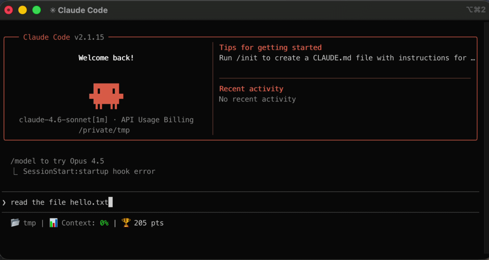

# claude-cheevos - Claude Code Achievement System

A self-contained achievement system for [Claude Code](https://claude.ai/code) that tracks your
usage milestones, awards points, and surfaces progress through a live status bar and achievement browser.



---

## Contents

[Requirements](#requirements) · [Installation](#installation) · [Uninstallation](#uninstallation) · [Getting Started](#getting-started) · [Achievement List](#achievement-list) · [Notifications](#notifications) · [Auto-Updates](#auto-updates) · [Leaderboard](#leaderboard) · [Contributing](#contributing)

---

## Requirements

- [Claude Code](https://claude.ai/code) installed (`~/.claude/settings.json` must exist)
- `bash` 3.2+ and `jq` 1.6+
- macOS, Linux, or Windows (via WSL)

---

## Installation

1. Download the zip for your platform from the [latest release](https://github.com/KyleLavorato/claude-cheevos/releases/latest):

   | Platform | File |
   |---|---|
   | macOS Apple Silicon | `claude-cheevos-darwin-arm64.zip` |
   | macOS Intel | `claude-cheevos-darwin-amd64.zip` |
   | Linux ARM64 | `claude-cheevos-linux-arm64.zip` |
   | Linux x86_64 | `claude-cheevos-linux-amd64.zip` |
   | Windows (WSL) | `claude-cheevos-windows-amd64.zip` |

2. Unzip and run the installer:

   ```bash
   unzip claude-cheevos-<platform>.zip
   ./install.sh
   ```

3. **Restart Claude Code** for hooks to take effect.

After install, your status bar shows `🏆 560 pts` at all times. If you had an existing
`statusLine` command it is preserved — cheevos appends to it.

The installer is **idempotent** — safe to re-run to upgrade. Your score and progress are never touched.

**Optional:** Enable leaderboard sync (obtain the secret from your leaderboard admin):

```bash
./install.sh --leaderboard-secret <secret>
```

**Verify the install:**

```bash
~/.claude/achievements/cheevos verify
```

---

## Uninstallation

Start a Claude session and use `/uninstall-achievements`. It removes hooks, optionally deletes state, and restores your original status line.

```bash
# Start a Claude session
claude

# Then run inside the session:
/uninstall-achievements
```

Alternatively, uninstall from your terminal:

```bash
~/.claude/achievements/uninstall.sh
```

---

## Getting Started

New to Claude Code? Start a Claude session and run the **interactive guided tour**:

```bash
# First, start a Claude session
claude

# Then inside the Claude session, run:
/achievements-tutorial
```

This walks you through **17 core achievements** (140 points) with step-by-step instructions:
- File operations (read, write, edit)
- Running shell commands and git workflows
- Web search and codebase exploration
- Advanced features (plan mode, code reviews, testing)
- Collaboration tools (GitHub, delegation, MCP)

Claude will **auto-detect** when you complete each achievement and automatically move to the next one. You can type "skip" to jump ahead at any time.

When you've completed all tutorial achievements, you'll see a trophy case celebration! 🏆

---

## Achievement List

Inside a Claude session, use `/achievements` to open the achievement browser — filter by status and skill level, search by name, and track progress bars for locked achievements.

```bash
# Start a Claude session
claude

# Then run inside the session:
/achievements
```

For the full list of achievements, categories, and skill levels, see [docs/achievement_list.md](docs/achievement_list.md).


---

## Notifications

When an achievement unlocks you get an inline system message inside Claude Code and a native
desktop notification (macOS notification center with Glass sound; PowerShell Toast on Windows).

```
🏆 Achievement Unlocked!
  [Power User +150 pts] Complete 100 Claude Code sessions
Total Score: 710 pts
```

Multiple unlocks in the same turn are batched into one notification.

---

## Auto-Updates

The system automatically updates both achievement definitions and the `cheevos` binary once
per day on session start. Your progress is always preserved.

- **Achievement definitions:** New achievements are fetched from GitHub
- **Binary updates:** The `cheevos` binary is updated to the latest release
- **Custom compilations:** Binary auto-updates are disabled if you built from source

```bash
# Force an immediate check for both
~/.claude/achievements/cheevos check-updates --force

# Check only definitions or binary
~/.claude/achievements/cheevos update-defs --force
~/.claude/achievements/cheevos update-binary --force
```

**Opt out of binary auto-updates:**

```bash
touch ~/.claude/achievements/.no-auto-update
```

See [docs/auto-update.md](docs/auto-update.md) for full details including security, rollback,
and disabling updates.

---

## Leaderboard

An optional live leaderboard lets you compare scores with teammates. The API token and
URL are never stored in plaintext — admins generate an encrypted secret using
`go/tools/keygen` and distribute it to users, who pass it to `install.sh --leaderboard-secret`.

See [DEVELOPING.md](DEVELOPING.md#generating-a-leaderboard-secret) for how to generate
the secret, and [microservice/README.md](microservice/README.md) for deploying the backend.

---

## Known Limitations

Some Claude Code built-in slash commands cannot be detected by the hook system and were
removed or redesigned as a result. Claude Code intercepts built-in commands
(`/doctor`, `/context`, `/model`, etc.) client-side before any message reaches the model —
they never appear in the transcript and do not trigger any hook event.

**Removed achievements:**

| Achievement | Command | Reason |
|---|---|---|
| Call an Ambulance...But Not For Me | `/doctor` | Client-side only; no hook or transcript entry is produced |
| Check Your Vitals | `/context` | Client-side only; no hook or transcript entry is produced |
| Model Citizen, Eclectic Taste, Model Collector, Model Sommelier | `/model` | Cross-session model tracking via transcript was unreliable in practice |

Note: `/compact` works because Claude Code fires a dedicated `PreCompact` hook event for
it. No equivalent hook exists for `/doctor`, `/context`, or `/model`.

---

## Contributing

See [DEVELOPING.md](DEVELOPING.md) for build instructions, adding custom achievements, and
Bash 3.2 compatibility notes.

For how achievements are tracked internally, see
[docs/how-achievements-are-tracked.md](docs/how-achievements-are-tracked.md).
